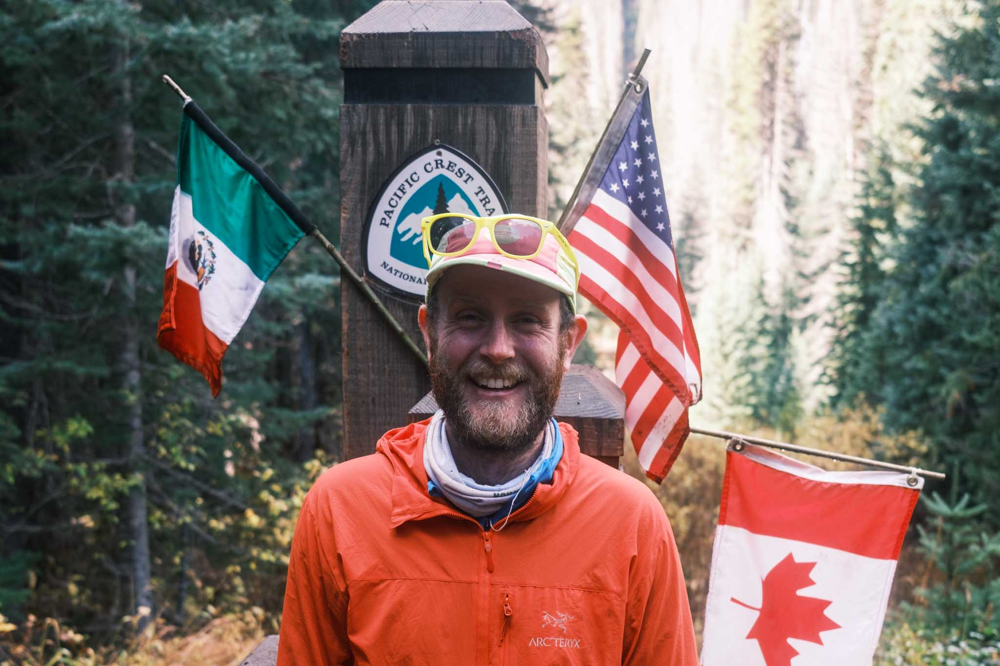

# Bio

## Shorter

Dr. Nicholas (Nick) Tierney is a statistician, [Research Software Engineer](https://researchsoftware.org/), and freelance consultant with a PhD in Statistics who specializes in data analytics, R package development, and teaching. Previously, he worked with [Prof. Nick Golding](https://www.thekids.org.au/contact-us/our-people/g/nick-golding/) at [The Kids Research Institute Australia](https://www.thekids.org.au/) and was a Research Fellow at Monash University with [Professor Dianne Cook](https://www.dicook.org/), where he developed tools for exploratory data analysis including [visdat](https://docs.ropensci.org/visdat/), [naniar](https://naniar.njtierney.com/), and [brolgar](https://brolgar.njtierney.com/) (more at his [github page](https://github.com/njtierney)). Nick actively writes about R related projects at his blog, ["credibly curious"](https://www.njtierney.com/). When not coding, Nick enjoys outdoor adventures and hiked the entire Pacific Crest Trail in 2023, documenting his journey at [njt.micro.blog](https://njt.micro.blog/).

## Longer

Dr. Nicholas (Nick) Tierney is a statistician, data scientist, and research software engineer with a PhD in Statistics and a Bachelor (Honours) in Psychological Science. He recently transitioned to private consulting, offering services in data analytics, modelling, code review, R package development, teaching, and mentoring.

Previously (2021-2025), Nick worked with [Prof. Nick Golding](https://www.thekids.org.au/contact-us/our-people/g/nick-golding/) at [The Kids Research Institute Australia](https://www.thekids.org.au/), maintaining the [greta R package](https://greta-stats.org/) for statistical modelling, and developing software and supporting the [Infectious Disease Ecology and Modelling team](https://www.thekids.org.au/our-research/brain-and-behaviour/child-health-analytics-research-program/infectious-disease-ecology-and-modelling/) as a [Research Software Engineer](https://researchsoftware.org/). Previously, he was a Research Fellow and Lecturer in Business Analytics at Monash University (2017-2020), collaborating with [Professor Dianne Cook](https://www.dicook.org/).

Nick is a passionate advocate for open-source software, having developed numerous R packages that improve data analysis workflows. His notable packages include [geotarget](https://ropensci.github.io/geotargets/) (geospatial pipelines) [visdat](https://docs.ropensci.org/visdat/) (pre exploratory data visualization), [naniar](https://naniar.njtierney.com/) (missing data analysis), [brolgar](https://brolgar.njtierney.com/) (longitudinal data exploration), 
[maxcovr](http://maxcovr.njtierney.com/) (optimisation), and [mmcc](http://mmcc.njtierney.com/) (MCMC diagnostics). Nick has also been actively writing about R and R related projects since 2013 at his blog, ["credibly curious"](https://www.njtierney.com/).

An outdoor enthusiast, Nick hiked the entire Pacific Crest Trail in 2023, completing a 5-month journey from Mexico to Canada. His personal blog at [njt.micro.blog](https://njt.micro.blog/) documents this adventure.

## Headshots

